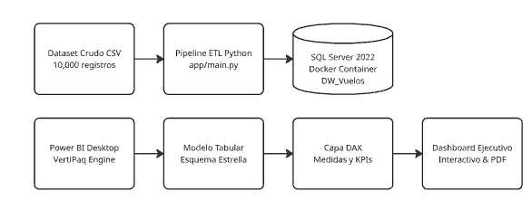
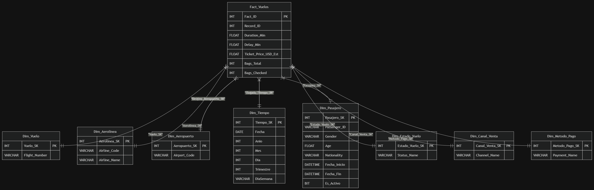
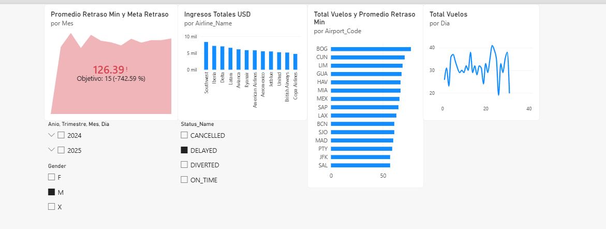
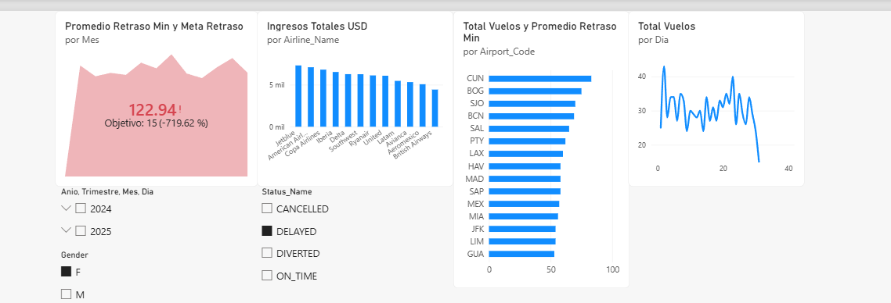

# Práctica 2 — Inteligencia de Negocios y Modelado Tabular con Power BI

**Universidad de San Carlos de Guatemala**  
**Facultad de Ingeniería — Escuela de Ciencias y Sistemas**  
**Curso:** Seminario de Sistemas 2  
**Grupo:** 14  
**Repositorio:** `SS22S2026_14G` / **Carpeta:** `Practica2`  

---

## 1. Resumen Ejecutivo y Objetivos Técnicos

El objetivo de esta práctica es diseñar, implementar y desplegar una solución integral de Inteligencia de Negocios (BI) sobre el Data Warehouse relacional `DW_Vuelos` generado a partir del pipeline de datos de la Práctica 1.

La solución abarca:
1. **Infraestructura y Pipeline de Carga:** Orquestación automatizada en Docker para SQL Server 2022 y carga de dimensiones y hechos limpios mediante Python (`SQLAlchemy`).
2. **Modelado Tabular Semántico:** Implementación de un esquema en estrella en Microsoft Power BI Desktop con relaciones optimizadas, dimensiones de rol (*Role-Playing*), dimensiones de cambio lento (SCD Tipo 2) y jerarquías temporales funcionales.
3. **Capa Analítica en DAX:** Creación de medidas agregadas y un KPI con lógica de semáforo orientada a la eficiencia operativa de la industria aeronáutica.
4. **Visualización y Analítica Interactiva:** Construcción de un dashboard ejecutivo con segmentación multidimensional, análisis de dispersión/demoras y navegación rápida.

---

## 2. Arquitectura de la Solución (End-to-End)





---

## 3. Diseño del Modelo Tabular Multidimensional

El modelo de datos se diseñó bajo un **esquema estrella puro (Star Schema)**, optimizado para el motor columnar en memoria **VertiPaq** de Power BI Desktop, garantizando máxima compresión y bajo tiempo de respuesta analítico.

### 3.1 Grano de la Tabla de Hechos
* **Tabla central:** `Fact_Vuelos`
* **Grano:** Cada fila representa una reserva/boleto individual emitida para un pasajero en un vuelo determinado (`Record_ID`), con sus métricas operativas y financieras asociadas (`Duration_Min`, `Delay_Min`, `Ticket_Price_USD_Est`, `Bags_Total`, `Bags_Checked`).

### 3.2 Catálogo Dimensional y Llaves Foráneas
La tabla de hechos se relaciona con 8 dimensiones mediante claves subrogadas enteras (`INT`):

| Dimensión | Llave Foránea en Hecho | Tipo / Característica Técnica | Propósito Analítico |
| :--- | :--- | :--- | :--- |
| **`Dim_Aerolinea`** | `Aerolinea_SK` | Conformed Dimension | Análisis de ingresos y volumen por operador aéreo. |
| **`Dim_Aeropuerto`** | `Origen_Aeropuerto_SK`<br>`Destino_Aeropuerto_SK` | **Role-Playing Dimension** | Manejo de dos roles geográficos (origen y destino) con relaciones activas e inactivas. |
| **`Dim_Tiempo`** | `Salida_Tiempo_SK`<br>`Llegada_Tiempo_SK` | Jerarquía Temporal Conformed | Navegación temporal multiescala (*Drill-Down / Roll-Up*). |
| **`Dim_Pasajero`** | `Pasajero_SK` | **SCD Tipo 2 (Slowly Changing)** | Trazabilidad histórica demográfica (`Gender`, `Age`, `Nationality`). |
| **`Dim_Estado_Vuelo`** | `Estado_Vuelo_SK` | Categorical Dimension | Filtro operativo (`ON_TIME`, `DELAYED`, `CANCELLED`, `DIVERTED`). |
| **`Dim_Canal_Venta`** | `Canal_Venta_SK` | Degenerate/Conformed | Canal de reserva (`Online`, `Airport Counter`, `Travel Agency`). |
| **`Dim_Metodo_Pago`** | `Metodo_Pago_SK` | Conformed Dimension | Medio financiero de liquidación (`Credit Card`, `Cash`, `Crypto`, etc.). |
| **`Dim_Vuelo`** | `Vuelo_SK` | Conformed Dimension | Código operacional de vuelo (`Flight_Number`). |

### 3.3 Jerarquía Funcional de Tiempo
Para permitir análisis escalonado sin requerir columnas calculadas redundantes, se implementó en `Dim_Tiempo` la jerarquía oficial:
$$\text{Anio} \longrightarrow \text{Trimestre} \longrightarrow \text{Mes} \longrightarrow \text{Dia}$$
Esta jerarquía permite al usuario gerencial realizar *Drill-Down* inmediato desde la tendencia anualizada hasta el comportamiento diario por día de semana.

---

## 4. Capa de Medidas DAX y Formulación del KPI

Para desacoplar la lógica de negocio de las columnas base del hecho, se implementó una tabla dedicada para métricas (`_Medidas`) utilizando lenguaje DAX (*Data Analysis Expressions*).

### 4.1 Medidas Base de Rendimiento

#### 1. Volumen Transaccional Total
Permite cuantificar la cardinalidad de vuelos/boletos procesados considerando el contexto de filtro aplicado.
```dax
Total Vuelos = COUNTROWS(Fact_Vuelos)
```

#### 2. Ingresos Brutos Estimados (USD)
Calcula la facturación totalizada en dólares, proporcionando la base financiera del negocio.
```dax
Ingresos Totales USD = SUM(Fact_Vuelos[Ticket_Price_USD_Est])
```

#### 3. Calidad de Servicio (Retraso Promedio)
Media aritmética del tiempo de retraso en minutos. Excluye automáticamente nulos correspondientes a vuelos cancelados para evitar distorsión estadística.
```dax
Promedio Retraso Min = AVERAGE(Fact_Vuelos[Delay_Min])
```

#### 4. Umbral de Tolerancia Operacional (Benchmark)
Constante de referencia estratégica fijada según los estándares de puntualidad de la industria aeronáutica (FAA/IATA: umbral de 15 minutos de tolerancia).
```dax
Meta Retraso = 15
```

---

### 4.2 Indicador Clave de Rendimiento (KPI) con Semáforo

El KPI implementado sintetiza la salud operativa de la aerolínea:
* **Indicador Base:** `[Promedio Retraso Min]`
* **Objetivo (Goal):** `[Meta Retraso]` (15 min)
* **Eje de Tendencia:** `Dim_Tiempo[Mes]`
* **Lógica del Semáforo (Status Direction):** Configurado con criterio **`Negative` / "El valor más bajo es bueno"**:
  * **Verde (Dentro de norma):** Retraso promedio $\le 15\text{ min}$.
  * **Rojo (Alerta operativa crítica):** Retraso promedio $> 15\text{ min}$.

---

## 5. Visualizaciones y Análisis de Hallazgos Estratégicos

El dashboard interactivo integra 4 visualizaciones principales, controles de navegación por botón y segmentadores cruzados:

### Vista 1: Segmentación de Pasajeros Masculinos y Vuelos Retrasados


#### Hallazgos Clave:
1. **Activación de Alerta Crítica en KPI:** Al aislar los vuelos con estado `DELAYED`, el promedio de retraso escala a **126.39 minutos**, sobrepasando en **-742.59%** la meta corporativa de 15 minutos. El indicador activa su semáforo en rojo para notificación gerencial inmediata.
2. **Concentración de Ingresos:** El ranking por aerolínea demuestra que **Southwest, Iberia y Delta** acumulan el mayor volumen monetario en este segmento (> $8,000 USD cada una).
3. **Cuellos de Botella Geográficos:** Los aeropuertos destino con mayor frecuencia de arribos demorados son **Bogotá (BOG), Cancún (CUN) y Lima (LIM)**, señalando rutas críticas donde la gerencia de operaciones debe auditar turnos de pista y logística en tierra.
4. **Comportamiento Temporal:** La gráfica de líneas permite monitorear los picos diarios del mes, identificando los días 5, 12, 23 y 28 como los de mayor saturación de tráfico.

---

### Vista 2: Reactividad Dinámica por Segmento Femenino


#### Hallazgos Clave:
1. **Sensibilidad del Indicador:** Al alternar el segmentador hacia el género femenino (`Gender = F`), el retraso promedio se recalcula instantáneamente a **122.94 minutos** (-719.62% sobre la meta), demostrando la propagación bidireccional de los filtros en el motor tabular.
2. **Reconfiguración Comercial:** La distribución de facturación se reordena drásticamente en tiempo real, pasando **JetBlue, American Airlines y Copa Airlines** a liderar la captación de ingresos brutos.
3. **Navegación Intuitiva:** El panel integra un botón de acción tipo `Back` para restablecer vistas o regresar en la jerarquía analítica.

---

## 6. Integridad de Datos y Reglas de Negocio (Data Governance)

Durante la fase de construcción de visualizaciones se aplicaron filtros preventivos para asegurar la veracidad de los datos:
* **Manejo de Vuelos Cancelados (`CANCELLED`):** Estos vuelos poseen `arrival_datetime = NULL` y `Delay_Min = NULL`. Al desplegar la jerarquía temporal, se excluyó intencionalmente la categoría `(En Blanco)`. De esta forma se previene que vuelos que nunca operaron se computen como "retraso cero" o alteren erróneamente la tasa de puntualidad.
* **Control de SCD Tipo 2:** La dimensión `Dim_Pasajero` maneja control de vigencia mediante `Es_Activo = 1`, garantizando que el análisis demográfico refleje los atributos vigentes del pasajero al momento del vuelo.

---

## 7. Guía de Despliegue y Reproducibilidad

### 7.1 Requisitos Previos
* **Docker Desktop** (con motor Linux activo).
* **Python 3.10+**.
* **Microsoft Power BI Desktop**.
* **ODBC Driver 18 for SQL Server** instalado en el sistema operativo.

### 7.2 Paso a Paso de Ejecución

#### 1. Configuración del Entorno Virtual
```powershell
cd C:\Users\engel\Documents\GitHub\SS22S2026_14G\Practica2
python -m venv .venv
.\.venv\Scripts\Activate.ps1
pip install -r requirements.txt
```

#### 2. Variables de Entorno (.env)
Crear un archivo `.env` en la raíz de `Practica2` con los parámetros de conexión:
```ini
DB_USER=sa
DB_PASSWORD=TuPasswordSeguro123!
DB_NAME=DW_Vuelos
DB_PORT=1433
CONTAINER_NAME=sql_server_bi
```

#### 3. Ejecución del Pipeline ETL y Contenedor
```powershell
python .\app\main.py
```
*El script levantará el contenedor de SQL Server 2022, creará la base de datos `DW_Vuelos`, ejecutará el DDL multidimensional y poblará las tablas.*

#### 4. Apertura y Actualización en Power BI
1. Abrir [`dashboard-practica2.pbix`](./dashboard-practica2.pbix) con Power BI Desktop.
2. En la pestaña **Inicio**, hacer clic en **Actualizar** (*Refresh*).
3. Si solicita autenticación de base de datos, seleccionar credenciales de **Base de datos**, usuario `sa` y la contraseña definida en el archivo `.env`.
4. El reporte se actualizará automáticamente con los datos del contenedor local.

---

