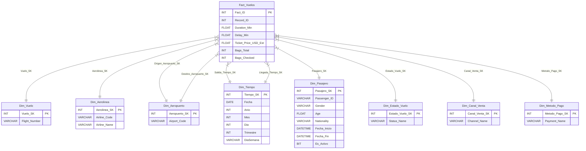

# Diagrama Entidad-Relación DW_Vuelos

```mermaid
erDiagram
    Fact_Vuelos {
        INT Fact_ID PK
        INT Record_ID
        FLOAT Duration_Min
        FLOAT Delay_Min
        FLOAT Ticket_Price_USD_Est
        INT Bags_Total
        INT Bags_Checked
    }
    
    Dim_Aerolinea {
        INT Aerolinea_SK PK
        VARCHAR Airline_Code
        VARCHAR Airline_Name
    }
    
    Dim_Aeropuerto {
        INT Aeropuerto_SK PK
        VARCHAR Airport_Code
    }
    
    Dim_Tiempo {
        INT Tiempo_SK PK
        DATE Fecha
        INT Anio
        INT Mes
        INT Dia
        INT Trimestre
        VARCHAR DiaSemana
    }
    
    Dim_Pasajero {
        INT Pasajero_SK PK
        VARCHAR Passenger_ID
        VARCHAR Gender
        FLOAT Age
        VARCHAR Nationality
        DATETIME Fecha_Inicio
        DATETIME Fecha_Fin
        BIT Es_Activo
    }

    Dim_Estado_Vuelo {
        INT Estado_Vuelo_SK PK
        VARCHAR Status_Name
    }

    Dim_Canal_Venta {
        INT Canal_Venta_SK PK
        VARCHAR Channel_Name
    }

    Dim_Metodo_Pago {
        INT Metodo_Pago_SK PK
        VARCHAR Payment_Name
    }

    Dim_Vuelo {
        INT Vuelo_SK PK
        VARCHAR Flight_Number
    }

    Fact_Vuelos }|--|| Dim_Vuelo : "Vuelo_SK"
    Fact_Vuelos }|--|| Dim_Aerolinea : "Aerolinea_SK"
    Fact_Vuelos }|--|| Dim_Aeropuerto : "Origen_Aeropuerto_SK"
    Fact_Vuelos }|--|| Dim_Aeropuerto : "Destino_Aeropuerto_SK"
    Fact_Vuelos }|--|| Dim_Tiempo : "Salida_Tiempo_SK"
    Fact_Vuelos }|--|| Dim_Tiempo : "Llegada_Tiempo_SK"
    Fact_Vuelos }|--|| Dim_Pasajero : "Pasajero_SK"
    Fact_Vuelos }|--|| Dim_Estado_Vuelo : "Estado_Vuelo_SK"
    Fact_Vuelos }|--|| Dim_Canal_Venta : "Canal_Venta_SK"
    Fact_Vuelos }|--|| Dim_Metodo_Pago : "Metodo_Pago_SK"
```