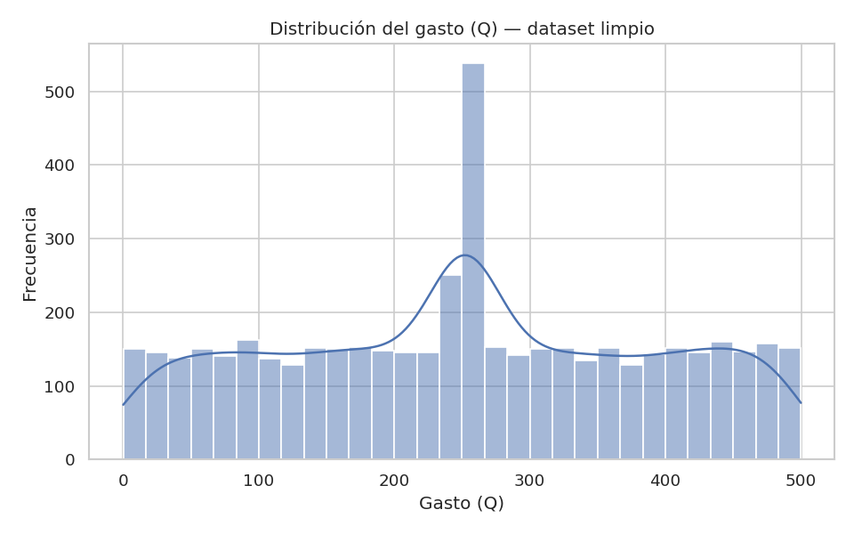
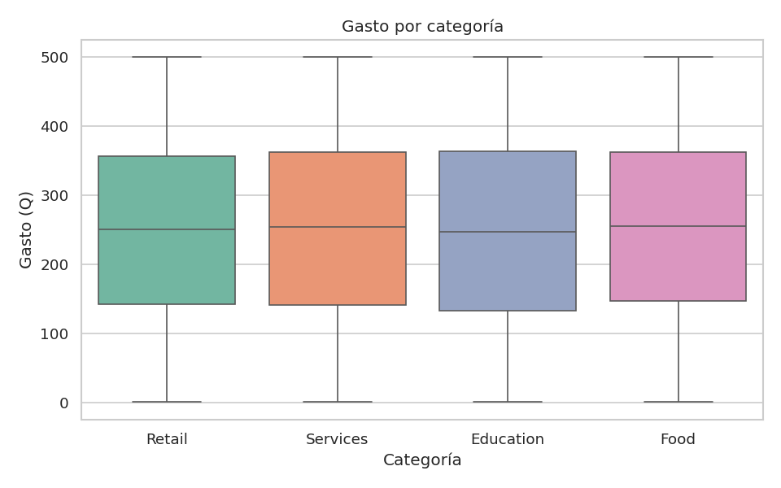
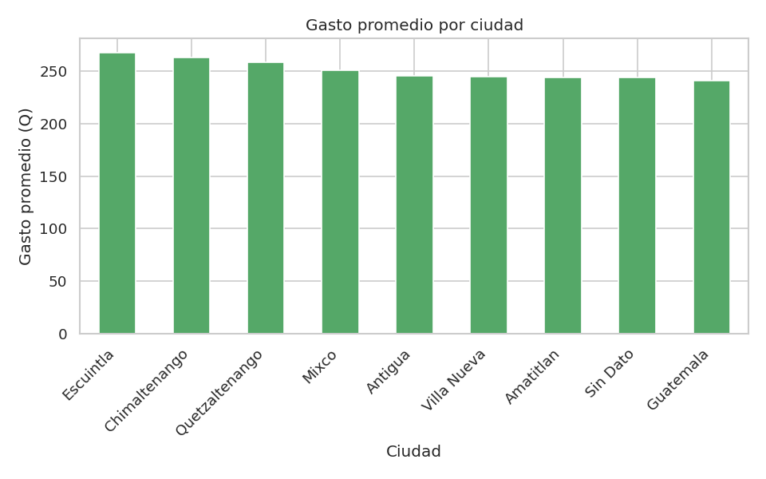
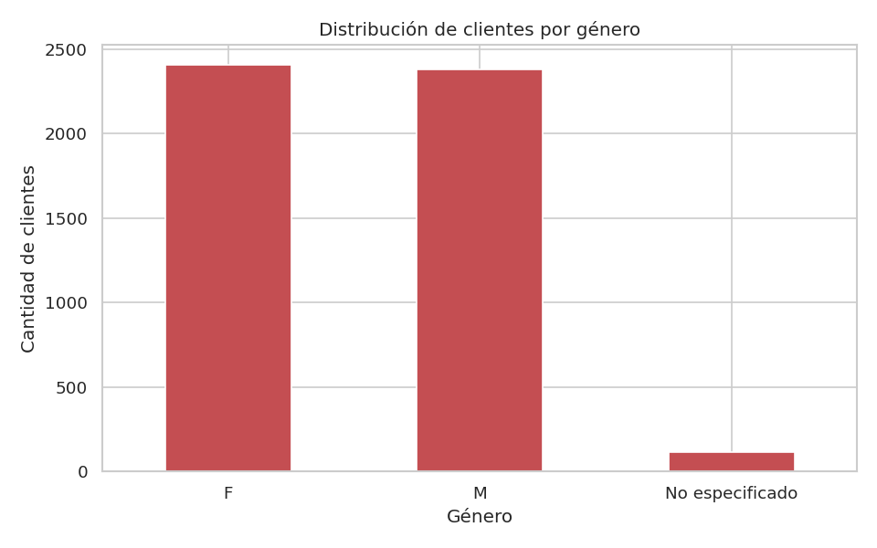
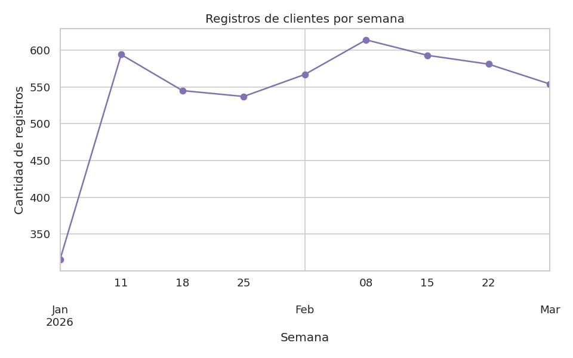
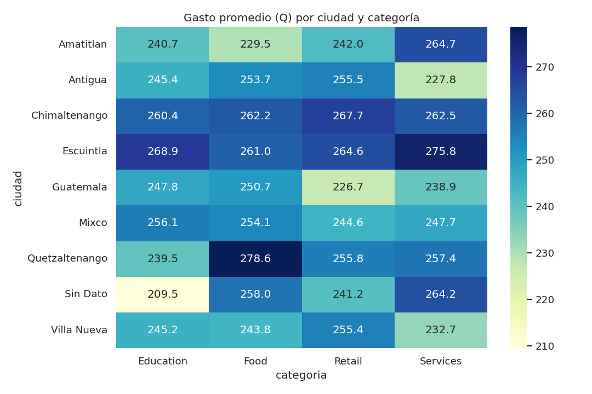

# Tarea #1 — Limpieza y análisis inicial de datos con Python y Pandas

**Curso:** Seminario de Sistemas 2
**Universidad:** Universidad de San Carlos de Guatemala — Facultad de Ingeniería — Ingeniería en Ciencias y Sistemas
**Estudiante:** Angel — Carné 202100215
**Grupo:** 14
**Repositorio:** `SS22S2026_14G` / Carpeta: `Tarea1`

---

## 1. Dataset utilizado

- **Nombre del archivo:** `dataset_sucio.csv`
- **Contenido:** registro sintético de clientes con las columnas `id_cliente`,
  `nombre`, `genero`, `fecha_registro`, `gasto_q` (gasto en quetzales), `ciudad` y
  `categoria` de compra.
- **Tamaño original:** 5,000 filas × 7 columnas.
- **Problemas de calidad detectados:** duplicados, valores faltantes, espacios y
  mayúsculas/minúsculas inconsistentes, dos formatos de fecha distintos y separador
  decimal mixto (`.` y `,`) en `gasto_q`.

## 2. Despliegue / ejecución en local

El proceso está disponible en **dos formatos equivalentes**, tal como lo permite el
enunciado de la tarea:

- **Notebook:** [`tarea1_limpieza_datos.ipynb`](./tarea1_limpieza_datos.ipynb)
- **Script:** [`tarea1_limpieza_datos.py`](./tarea1_limpieza_datos.py) (misma lógica,
  pensado para correr directamente desde terminal sin necesidad de Jupyter)

Ambos leen `dataset_sucio.csv`, generan las visualizaciones `.png` y exportan
`dataset_limpio.csv` / `dataset_limpio.parquet` en la misma carpeta.

### 2.1 Requisitos previos

- Python 3.10 o superior instalado ([python.org](https://www.python.org/downloads/)).
- `pip` disponible (viene incluido con Python).

### 2.2 Pasos para ejecutar en local

1. Clona o descarga este repositorio y ubícate en la carpeta `Tarea1`:
   ```bash
   cd SS22S2026_14G/Tarea1
   ```
2. (Recomendado) Crea y activa un entorno virtual:
   ```bash
   python -m venv venv

   # Windows
   venv\Scripts\activate

   # macOS / Linux
   source venv/bin/activate
   ```
3. Instala las dependencias del proyecto:
   ```bash
   pip install -r requirements.txt
   ```
4. Ejecuta el proceso con **una de las dos opciones**:

   **Opción A — Script de Python (recomendada, no requiere Jupyter):**
   ```bash
   python tarea1_limpieza_datos.py
   ```
   El script imprime en consola cada paso del proceso (estado antes/después, tablas
   pivote, conteos) y genera todos los archivos de salida (`.png`, `.csv`, `.parquet`)
   en la misma carpeta.

   **Opción B — Notebook de Jupyter:**
   ```bash
   jupyter notebook tarea1_limpieza_datos.ipynb
   ```
   Esto abre el notebook en el navegador; solo debes ejecutar todas las celdas
   (`Cell > Run All` o `Kernel > Restart & Run All`). El notebook ya viene con las
   salidas guardadas de una ejecución previa, así que también puede revisarse sin
   volver a correrlo.

### 2.3 Requerimientos (`requirements.txt`)

```
pandas>=2.0
numpy>=1.24
matplotlib>=3.7
seaborn>=0.12
pyarrow>=14.0

# Solo necesarios si vas a correr el notebook (.ipynb) en vez del script (.py)
jupyter>=1.0
notebook>=7.0
ipykernel>=6.0
```

## 3. Descripción del proceso de limpieza

El proceso completo está documentado paso a paso en el notebook
[`tarea1_limpieza_datos.ipynb`](./tarea1_limpieza_datos.ipynb) y en el script
[`tarea1_limpieza_datos.py`](./tarea1_limpieza_datos.py). Resumen de las
transformaciones aplicadas:

| # | Transformación | Detalle |
|---|---|---|
| 1 | Eliminación de duplicados | `drop_duplicates()` → se eliminaron **100 filas** duplicadas (2% del dataset). |
| 2 | Estandarización de `nombre` | `strip()` + `title()` + normalización de espacios múltiples. |
| 3 | Estandarización de `genero` | Homologado a `M` / `F`; vacíos o inválidos → `"No especificado"`. |
| 4 | Estandarización de `ciudad` | `strip()` + `title()`; de 42 variantes de texto a 7 ciudades reales; nulos → `"Sin Dato"`. |
| 5 | Estandarización de `categoria` | `strip()` + `title()`; de 16 variantes a 4 categorías reales (Retail, Services, Education, Food). |
| 6 | Estandarización de `fecha_registro` | Detección y conversión de los dos formatos (`YYYY-MM-DD` y `DD/MM/YYYY`) a `datetime64`. |
| 7 | Tratamiento de `gasto_q` | Conversión de coma decimal a punto, cast a `float`; **505 valores faltantes** imputados con la mediana por categoría. |

**Resultado:** dataset limpio de **4,900 filas**, sin valores nulos, con tipos de dato
correctos (`datetime64` y `float64`) y categorías de texto homologadas, exportado como
`dataset_limpio.csv` y `dataset_limpio.parquet`.

## 4. Tablas y visualizaciones generadas

### Tabla pivote — Antes vs. Después

Antes de la limpieza, `gasto_q` era texto con formato inconsistente, por lo que solo
fue posible construir una tabla pivote de **conteo de registros** por ciudad/categoría.
Después de la limpieza, se construyó una tabla pivote de **gasto promedio (Q)** por
ciudad y categoría, la cual habría sido imposible de calcular de forma confiable sobre
los datos originales.

*(Ver la ejecución completa de ambas tablas —`pivot_antes` y `pivot_despues`— con sus
salidas dentro del notebook, secciones 3 y 5).*

### Visualizaciones

**Distribución del gasto (dataset limpio)**



**Gasto por categoría**



**Gasto promedio por ciudad**



**Distribución de clientes por género**



**Registros de clientes por semana**



**Heatmap: gasto promedio por ciudad y categoría**



## 5. Interpretación de resultados

- Se eliminaron **100 filas duplicadas**, evitando sobrecontar clientes en cualquier
  análisis agregado posterior.
- Los **722 valores faltantes** repartidos entre `genero`, `gasto_q` y `ciudad` se
  trataron sin perder registros: `gasto_q` se imputó con la mediana por categoría
  (más robusta ante outliers que la media), mientras que `genero` y `ciudad` se
  marcaron explícitamente en vez de eliminarse, preservando la trazabilidad de los
  datos faltantes.
- La homologación de texto (mayúsculas, espacios, tildes de formato) redujo `ciudad`
  de 42 variantes a 7 ciudades reales y `categoria` de 16 a 4 categorías reales —
  antes de limpiar, "Retail", "RETAIL" y "retail" se contaban como grupos distintos,
  lo que habría invalidado cualquier agregación por categoría.
- El gasto se concentra mayormente entre Q100 y Q400, con las categorías **Services**
  y **Education** mostrando montos promedio algo más altos que **Food**.
- El gasto promedio no varía de forma extrema entre ciudades, lo que sugiere un
  comportamiento de consumo relativamente homogéneo entre las zonas geográficas
  representadas en el dataset.
- Los registros de clientes se distribuyen de manera razonablemente uniforme semana
  a semana, sin picos que sugieran errores de captura por periodo.

## 6. Archivos incluidos en esta carpeta

```
Tarea1/
├── tarea1_limpieza_datos.ipynb   # Notebook con todo el proceso (código + salidas)
├── tarea1_limpieza_datos.py      # Script equivalente, para correr desde terminal
├── requirements.txt              # Dependencias para ejecutar en local
├── dataset_sucio.csv             # Dataset original proporcionado
├── dataset_limpio.csv            # Dataset limpio exportado
├── dataset_limpio.parquet        # Dataset limpio exportado (formato Parquet)
├── viz_distribucion_gasto.png
├── viz_gasto_por_categoria.png
├── viz_gasto_por_ciudad.png
├── viz_distribucion_genero.png
├── viz_registros_tiempo.png
├── viz_heatmap_ciudad_categoria.png
└── README.md                     # Este archivo
```
